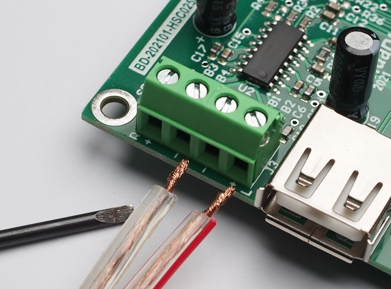
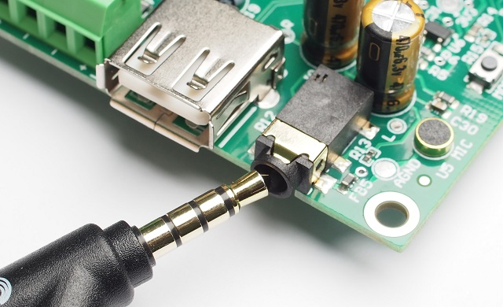
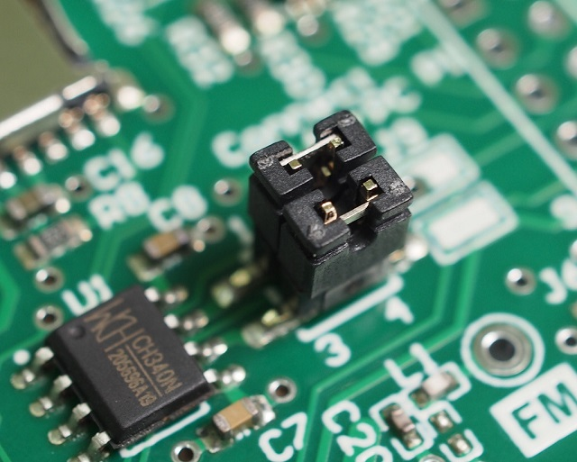

# HSC025A-an-one-dollar-Bluetooth-SoC

## Introduction

HSC025A is a Bluetooth Audio System-on-Chip (SoC) delivering wireless audio with a UART interface that supports creation of your featured audio player. With a firmware developed on top of the Bluetooth SoC (AC6925A) fabricated by Zhuhai Jieli Technology Co. Ltd., HSC025A provides the following features:

- Stand-alone operation with push buttons or slave operation with MCU control through UART interface
- Bluetooth Classic - BR/EDR with three profiles supported
  - Headset profile (HSP)
  - Hands-free profile (HFP)
  - AudioSink - Advanced Audio Distribution Profile (A2DP - SNK)
  - Audio/Video Remote Control Profile (AVRCP)
- 1 USB 2.0 OTG host controller for USB mass storage connection (up to 64GB)
- 1 microSD/SD card controller (up to 64GB)
- Audio file playback from USB or microSD/SD card in MP3/WAV/WMA/FLAC/APE formats
- FM radio supporting worldwide frequency band 87.5-108.0MHz
- Integrated 16-bit stereo DAC with headphone amplifier (SNR>=95dB) 
- 1 channel MIC input with an integrated amplifier for hands-free phone call
- 1 integrated low dropout regulator (LDO) delivering 3.3V that sources up to 150mA
- Current consumption less than 10mA @5V in sleep mode

## Pin Configuration

| Pin No. | Name    | I/O Type | Function                                                     |
| ------- | ------- | -------- | ------------------------------------------------------------ |
| 1       | SDCLK   | O        | Serial clock for microSD / SD card                           |
| 2       | SDCMD   | O        | Command output for microSD/SD card                           |
| 3       | SDDAT   | I/O      | Data Line [Bit0] [^1]                                        |
| 4       | USBDM   | I/O      | USB negative data line                                       |
| 5       | USBDP   | I/O      | USB positive data line                                       |
| 6       | MICIN   | I        | Mic input channel                                            |
| 7       | DACR    | O        | DAC right output channel                                     |
| 8       | DACL    | O        | DAC left output channel                                      |
| 9       | DACVDD  | Power    | DAC power. Bypass this pin with a 1uF  ceramic capacitor.    |
| 10      | VCOM    | Power    | DAC reference. Bypass this pint with a 1uF ceramic capacitor. |
| 11      | DACVSS  | Power    | DAC ground                                                   |
| 12      | VDDIO   | Power    | 3.3V LDO power output (150mA max loading)                    |
| 13      | BT_LED  | O        | GPIO pin configured as an activity LED indicator             |
| 14      | ADKEY   | I        | GPIO pin configured as an ADC pin for button operation       |
| 15      | MUTE    | O        | GPIO pin configured as an output pin when mute (mute=0, operate=1) |
| 16      | UART_RX | I        | UART data input (default baud rate = 9600bps, 8-n-1)         |
| 17      | UART_TX | O        | UART data output (default baud rate = 9600bps, 8-n-1)        |
| 18      | VBAT    | Power    | Power input (2.2V - 5.5V)                                    |
| 19      | BT_AVDD | Power    | Analog power (1.3V). Bypass this pin with a 1uF ceramic capacitor. |
| 20      | BT_RF   | I/O      | RF antenna feed line for Bluetooth                           |
| 21      | FM_IP   | I/O      | RF antenna feed line for FM radio                            |
| 22      | VSSIO   | Power    | Digital ground                                               |
| 23      | BT_OSCI | I        | 24MHz crystal oscillator input (accuracy +/-10ppm or better) |
| 24      | BT_OSCO | O        | 24MHz crystal oscillator output (accuracy +/-10ppm or better) |

## Electrical Characteristics

| Pin Name | Parameter      | Min  | Typ  | Max  | Unit | Test Conditions                  |
| -------- | -------------- | ---- | ---- | ---- | ---- | -------------------------------- |
| DACVDD   | DAC voltage    | -    | 3.1  | -    | V    | VBAT = 5V, DACVDD loading=10mA   |
| VCOM     | DAC voltage    | -    | 1.5  | -    | V    | -                                |
| VDDIO    | Voltage output | -    | 3.3  | -    | V    | VBAT = 5V, VDDIO loading = 150mA |
| VBAT     | Voltage input  | 2.2  | 3.7  | 5.5  | V    | -                                |
| BT_AVDD  | Analog voltage | -    | 1.3  | -    | V    | VBAT = 5V                        |

## Digital Terminal Characteristics

**Test conditions: VDDIO = 3.3V**

| Terminals               | Symbol | Min       | Typ  | Max       | Unit |
| ----------------------- | ------ | --------- | ---- | --------- | ---- |
| Input logic level low   | VIL    | -0.3      | -    | 0.3*VDDIO | V    |
| Input logic level high  | VIH    | 0.7*VDDIO | -    | VDDIO+0.3 | V    |
| Output logic level low  | VOL    | -         | -    | 0.33      | V    |
| Output logic level high | VOH    | 2.7       | -    | -         | V    |

## DAC Characteristics

**Test conditions: 1kHz/0dB @10k Ohm loading**

| Parameter                          | Min  | Typ  | Max  | Unit |
| ---------------------------------- | ---- | ---- | ---- | ---- |
| Frequency response                 | 20   | -    | 20k  | Hz   |
| THD+N                              | -    | -69  | -    | dB   |
| S/N                                | -    | 95   | -    | dB   |
| Output swing                       |      | 1    |      | Vrms |
| Dynamic range                      |      | 90   |      | dB   |
| DAC output power (@ 32Ohm loading) | 11   |      | -    | mW   |

## Bluetooth Characteristics

| Parameter              | Min  | Typ  | Max  | Unit |
| ---------------------- | ---- | ---- | ---- | ---- |
| RF frequency range     | 2.40 | -    | 2.48 | GHz  |
| RF transmit power      |      | 0    | 4    | dBm  |
| RF receive sensitivity |      | -89  |      | dBm  |
| Transmission range     | -    | -    | 10   | m    |
| Power Class            | -    | 2    | -    |      |

## FM Receiver Characteristics

| Parameter                             | Min  | Typ  | Max   | Unit     | Test Conditions |
| ------------------------------------- | ---- | ---- | ----- | -------- | --------------- |
| Input frequency                       | 87.5 |      | 108.0 | MHz      |                 |
| Sensitivity                           | 3    | 4    | 8     | dBuV EMF | (S+N)/N=26dB    |
| Audio output voltage                  | 0    |      | 3     | V        | Empty loading   |
| Audio frequency response              | 20   |      | 20k   | Hz       | DAC test        |
| Audio (S+N)/N                         |      | 52   |       | dB       |                 |
| Audio total harmonic distortion (THD) |      | 0.4  |       | %        |                 |

## Package Information

### SOP24 (0.65mm pitch)

## Communication Protocol

HSC025A communicates with an external system (e.g. an MCU) by UART (Universal Asynchronous Receive/Transmit) via UART_TX and UART_RX pins in 3.3V (VDDIO) level. The default baud rate is 9600bps of 8-bit data, no parity with 1 stop bit with a command format shown below.

**Command format `(0x7E  len  cmd  param1  param2  0xEF)`** 

| Byte to send | Description                                                  |
| ------------ | ------------------------------------------------------------ |
| `0x7E`       | Start of transmission (STX).                                 |
| `len`        | Byte count of the command string excluding STX and ETX bytes |
| `cmd`        | This is the command byte to send                             |
| `param1`     | 1st parameter (optional)                                     |
| `param2`     | 2nd parameter (optional)                                     |
| `0xEF`       | End of transmission (ETX)                                    |

The communication is a bidirectional data flow with equal priority as the data sender between HSC025A and the MCU. That means it is possible for you to program the MCU to transmit a command to HSC025A and get replies from it or, HSC025A initiates the communication by sending over its status and parameters to the MCU on an external trigger.

**Example 1: The MCU sets HSC025A to Bluetooth mode**

Command: `7E 03 0D 04 EF`

Explanation: 

| MCU sending | Description                                                  |
| ----------- | ------------------------------------------------------------ |
| `0x7E`      | STX                                                          |
| `0x03`      | Byte count with STX and ETX excluded                         |
| `0x0D`      | Command to switch operation mode                             |
| `0x04`      | Bluetooth mode  (param1=0x04 for Bluetooth, no param2 required) |
| `0xEF`      | ETX                                                          |

**Note: You may need to enable mermaid diagram rendering in your browser (Chrome) to view sequence diagrams from: 
https://chrome.google.com/webstore/detail/mermaid-diagrams/phfcghedmopjadpojhmmaffjmfiakfil/related**

Sequence diagram:

Sequence diagram above may keep rolling if there are more activities coming up. For example, an incoming call during music playback will trigger HSC025A to send `7E 03 50 29 EF` to indicate a phone call with `param1=0x29` followed by `7E 03 50 2A EF` to resume music playback `(param1=0x2A)` when the call ends.

**Example 2: User clicks and holds on the Volume-up key (via a resistor network wired to ADKEY pin) on HSC025A, in music playback mode**

Commands: `7E 03 0E 06 EF`  `7E 03 0E 07 EF`  `7E 03 0E 08 EF`

Explanation:

| HSC025A sending | Description                                     |
| --------------- | ----------------------------------------------- |
| `0x7E`          | STX                                             |
| `0x03`          | Byte count                                      |
| `0x0E`          | Get current volume                              |
| `param1`        | `param1 = 0x06, 0x07, 0x08` as volume increases |
| `0xEF`          | ETX                                             |

Sequence diagram:

## Command Table

### Public Commands

| cmd (command byte in hex) | Function                                                     | MCU transmits in hex                                         | HSC025A returns in hex                                       |
| ------------------------- | ------------------------------------------------------------ | ------------------------------------------------------------ | ------------------------------------------------------------ |
| `0x00`                    | Mode switch in a round robin manner (Standby:0  USB:1  SD:2  Bluetooth:4  FM:5  REC:7 (REC not implemented)) **Remarks:** Device goes into standby mode (0) on power up. | `7E 02 00 EF`                                                | The target mode to switch, e.g.  `7E 03 0C 05 EF` if FM radio is the target mode. Byte `0x0C` is the command to get the current mode of operation with 0x05 as the parameter for FM radio. See command ` 0x0C` below. |
| `0x01`                    | Playback from the location paused or restart from beginning **Remark:**  (1) If audio was paused with a command `0x02` (see below), this command continues playback from the last location (2) If audio was stopped with a command `0x0A` (see below), this command restarts playback from the beginning (3) MUTE pin set high on this command (4) EDR status also changed on this command | `7E 02 01 EF`                                                | EDR status if Bluetooth is connected (see command `0x50` below) |
| `0x02`                    | Pause (during playback) **Remark:**  (1) MUTE pin set low on this command (2) EDR status also changed on this command | `7E 02 02 EF`                                                | EDR status if Bluetooth is connected (see command `0x50` below) |
| `0x03`                    | Next title/episode/FM station number                         | `7E 02 03 EF`                                                | Return the target title for USB/SD or FM station number for radio. No return for Bluetooth.  |
| `0x04`                    | Previous title/episode/FM station number                     | `7E 02 04 EF`                                                | Return the target title for USB/SD or FM station number for radio. No return for Bluetooth.  |
| `0x05`                    | Set volume up (0 - 30 in decimal)                            | `7E 02 05 EF`                                                | Return the target volume after increment, e.g. `7E 03 0E 07 EF` with `0x0E` as the command to get current volume and `0x07` as the volume level (max 0x1E). |
| `0x06`                    | Set volume down (0 - 30 in decimal)                          | `7E 02 06 EF`                                                | Return the target volume after decrement, e.g. `7E 03 0E 0F EF` with `0x0E` as the command to get current volume and `0x0F` as the volume level (min 0x00). |
| `0x07`                    | Go to sleep (consumes less than 10mA). All commands disabled after this command except a wakeup command `0x08` **Remarks:** Sleep is not standby mode. In sleep mode, HSC025A does not accept new command except Wakeup `0x08`, but in standby mode all new commands are accepted. Standby mode is the default state after power up. | `7E 02 07 EF`                                                | `7E 03 07 00 EF`                                             |
| `0x08`                    | Wakeup from sleep                                            | `7E 02 08 EF`                                                | `7E 03 08 01 EF` followed by the results of current mode request with automatic issuing of command `0x0C` |
| `0x09`                    | Toggle between pause/play                                    | `7E 02 09 EF`                                                | -                                                            |
| `0x0A`                    | Stop playing and restart if it is followed by the playback command (0x01) | `7E 02 0A EF`                                                | -                                                            |
| `0x0B`                    | Request if USB/SD card is available                          | `7E 02 0B EF`                                                | `7E 03 0B param1 EF` `param1` is the bitwise combination of USB:bit(0) and SD:bit(1) `param1=1` if only USB mass storage is available `param1=2` if only SD card is available `param1=3` if both USB mass storage and a SD card are available |
| `0x0C`                    | Get the current mode of operation (Standby:0  USB:1  SD:2  Bluetooth:4  FM:5  REC:7) | `7E 02 0C EF`                                                | `7E 03 0C param1 EF` `param1=0` Standby `param1=1` USB mode `param1=2` SD card mode `param1=4` Bluetooth mode `param1=5` FM radio mode `param1=7` Recorder mode (not implemented yet) |
| `0x0D`                    | Set a target operation mode (Standby:0  USB:1  SD:2  Bluetooth:4  FM:5  REC:7(not implemented)) | `7E 03 0D param1 EF`  (param1=0 for standby, 1 for USB, 4 for Bluetooth etc.) | Return the target mode of operation, e.g. ***1)*** `7E 03 0C param1 EF` `param1=0` Standby `param1=1` USB mode `param1=2` SD card mode `param1=4` Bluetooth mode `param1=5` FM radio mode ***2)*** optional: `7E 03 0C 04 EF` + EDR status if the target mode is Bluetooth. See description below on command `0x50` for EDR status request |
| `0x0E`                    | Get current volume (0 - 30 in decimal)                       | `7E 02 0E EF`                                                | `7E 03 0E param1 EF` to return the current volume level `param1 = volume (0 - 30 in decimal)`, e.g. `7E 03 0E 0B EF` to indicate a volume of 11 in decimal. |
| `0x0F`                    | Set volume to a target level (0 - 30 in decimal)             | `7E 03 0F param1 EF` (param1= volume level from 0 to 30 in decimal) | `7E 03 0E param1 EF` to return the target volume, e.g. MCU sends `7E 03 0F 0D EF` HSC025A returns `7E 03 0E 0D EF` |
| `0x10`                    | Get firmware version                                         | `7E 02 10 EF`                                                | `7E 03 10 12 EF` for firmware version 1.2                    |
| `0x11`                    | Enable/disable ADKEY function for push button operation      | `7E 03 11 param1 EF` (param1=0 to disable, 1 to enable) **Default: 1** | Echo the same command sent to HSC025A as an acknowledgement  |
| `0x15`                    | Mute / Unmute audio **Remarks:**  (1) Use this command with care in conjunction with pause/playback commands. This command works independent of the pause `0x02` and playback `0x01` commands. You may have forgot to unmute an audio before sending over a playback command with no audio output. This may lead to a playback malfunction confusion. (2) Send `7E 03 15 01 EF` first to use this command (erratic) | `7E 03 15 param1  EF` (param1=0 mute, 1 to unmute)        | Echo the same command sent to HSC025A with `param1` negated, i.e. return `7E 03 15 01 EF` when `7E 03 15 00 EF` is sent to HSC025A and vice versa |
| `0x16`                    | System restart                                               | `7E 02 16 EF`                                                | `7E 02 08 EF` to indicate a normal operation status          |
| `0x17`                    | System restore to factory settings (need system restart by power removal to take effect) | `7E 02 17 EF`                                                | `7E 02 08 EF` to indicate a normal operation followed by `7E 03 0C 00 EF` to indicate HSC025A in standby mode if there is no USB/SD media in slots |
| `0x18`                    | Set baud rate according to 0:9600, 1:19200, 2:38400, 3:115200, 4:256000 (need system restart by power removal to take effect) | `7E 03 18 param1 EF` (param1=0,1,2,3,4)                      | Echo the same command sent to HSC025A as an acknowledgement  |
| `0x19`                    | Enable (1) / disable (0) priority playback from USB/SD card  | `7E 03 19 param1 EF ` (param1=0 to disable, 1 to enable) **Default: 1** | Echo the same command sent to HSC025A as an acknowledgement  |
| `0x1A`                    | Enable (1) / disable (0) playback time return in an 1 sec interval. Only valid for USB/SD card playback | `7E 03 1A param1 EF`  (param1=0 to disable, 1 to enable) **Default: 0** | Echo `7E 03 1A 00 EF` as an acknowledgement when disable.  Echo `7E 03 1A 01 EF` followed by `7E 04 35 msb lsb EF` with [msb:lsb] the higher byte and lower byte to indicate the playback time in seconds. This command is useful if a playback timer GUI is required. |
| `0x1B`                    | Enable (1) / disable (0) key press beep                      | `7E 03 1B param1 EF` (param1=0 to disable, 1 to enable) **Default: 1** | Echo the same command as an acknowledgement                  |
| `0x1C`                    | Enable (1) / disable (0) FM radio presence, i.e. no FM radio mode if param1 = 0 | `7E 03 1C param1 EF` (param1=0 to disable, 1 to enable) **Default: 1** | Echo the same command as an acknowledgement                  |
| `0x46`                    | (USB/SD card mode only) Enable/disable automatic advance playback to the next title | `7E 03 46 param1 EF`  (param1=0 to enable automatic advance, param1=1 disable ) **Default:** 0 | Echo the same command as an acknowledgement                  |
| `0x50`                    | Get EDR Bluetooth status (valid in Bluetooth mode only)      | `7E 02 50 EF`                                                | `7E 03 50 param1 EF` `param1=0x25` to indicate initialization in progress `param1=0x26` waiting for connection `param1=0x27` connecting `param1=0x28` connected and waiting for phone call or music `param1=0x29` in a phone call `param1=0x2A` in music playback |
| `0x52`                    | Return the MAC address of your HSC025A (valid in Bluetooth mode only) | `7E 02 52 EF`                                                | MAC address in format `7E 08 52 xx xx xx xx xx xx EF` (6 bytes) |
| `0x54`                    | Return the MAC address of the connected Bluetooth host (valid in Bluetooth mode only) | `7E 02 54 EF`                                                | MAC address in format `7E 08 54 xx xx xx xx xx xx EF` (6 bytes) |
| `0x55`                    | Return the name of Bluetooth device (valid in Bluetooth mode only) | `7E 02 55 EF`                                                | `7E 09 UHSC025A EF` with `UHSC025A` being the ASCII representation |
| `0x56`                    | Return the name of Bluetooth host (e.g. your smart phone) connected (valid in Bluetooth mode only) | `7E 02 56 EF`                                                | Echo the same command if no Bluetooth host is connected. Return the name of Bluetooth host connected in ASCII `7E len name EF` if any with `name` being the ASCII representation |
| Invalid                   | Any invalid command                                          | `7E 02 xx EF` **Remark:** xx is an invalid command        | Any invalid command returns `7E 02 EE EF`                    |

### Commands valid in mode of USB Mass Storage / SD card only

1) Automatic playback from an USB/SD media when it is slot in, in the order of the files in FAT/FAT32's file table. How files are sorted in a file system is more complex than we have thought. Interested readers may visit https://www.codeproject.com/Articles/95721/FAT-32-Sorter or https://superuser.com/questions/376577/how-to-reorder-the-files-of-a-fat32-file-system for further information 2) Format media in FAT or FAT32. No NTFS is allowed. 3) Supported file formats: MP3/WAV/WMA/FLAC/APE 4) Filenames in both ASCII and Unicode formats are supported 5) Both short and long filenames are supported 6) Comply with the following folder and filename conventions if you want to play designated audio files with UART commands: 

- append a 4-digit prefix, e.g. 0001, 0002, 4678 say, for files in the root directory 
- use a 3-digit folder name, e.g. 002, 232 
- append a 3-digit prefix in the range of 000 - 255 for files in all folders  

7) Sequential command is allowed, e.g. it is allowed to send over `7E 04 42 02 08 EF 7E 04 42 02 09 EF` to preemptive playback two voice files 008.wav and 009.wav from the folder `/002` 

| cmd (command byte in hex) | Function                                                     | MCU transmits in hex                                         | HSC025A returns in hex                                       |
| ------------------------- | ------------------------------------------------------------ | ------------------------------------------------------------ | ------------------------------------------------------------ |
| `0x30`                    | Get playback status                                          | `7E 02 30 EF`                                                | `7E 03 0C param1 EF` `param1=0` (Stop) `param1=1` (Play) `param1=2` (Pause) `param1=3` (FF) `param1=4` (FR) |
| `0x31`                    | Get current playback mode                                    | `7E 02 31 EF`                                                | `7E 03 31 param1 EF` `param1=0` (all files in root and all folders are played repeatedly)  `param1=1` (reserve) `param1=2` (repeat playing the current file) `param1=3` (shuffle play)  `param1=4` (playback from root/current folder only) |
| `0x32`                    | Set playback mode                                            | `7E 03 32 param1 EF` param1 = 0 (all files in root/all folders are played repeatedly) param1 = 1 (reserve) param1 = 2 (repeat playing the current file) param1 = 3 (shuffle play) param1 = 4 (playback from root/current folder only) **Default: 0** | Echo the same command as an acknowledgement                  |
| `0x33`                    | Get the order of the files in FAT/FAT32 file system, which is also the order of copying the files to a storage media **Remarks:** 1) order of files in FAT/FAT32 filesystem is **not** the number prefix in the filename as mentioned in point 5 above (filename conventions) 2) you may use a simple program, e.g. FAT Reader (http://public.bplaced.net/) to sort the FAT/FAT32 file order | `7E 02 33 EF`                                                | `7E 04 33 msb lsb EF` [msb:lsb] returns the FAT/FAT32 order number (0x0001 - 0xFFFF) with msb the higher byte, lsb the lower byte |
| `0x34`                    | Get total number of *audio files* in the media **Remark:** only compatible audio files are counted | `7E 02 34 EF`                                                | `7E 04 34 msb lsb EF` [msb:lsb] returns the total number of audio files in the media (all directories) in range 0x0001-0xFFFF with msb the higher byte, lsb the lower byte |
| `0x35`                    | Get current playback location in seconds                     | `7E 02 35 EF`                                                | `7E 04 35 msb lsb EF` [msb:lsb] returns the current playback location in seconds with msb the higher byte, lsb the lower byte |
| `0x36`                    | Get the length of the current title in seconds               | `7E 02 36 EF`                                                | `7E 04 36 msb lsb EF` [msb:lsb] returns the length in seconds with msb the higher byte, lsb the lower byte **Example:** [msb:lsb] returns 0x02 0x58 to indicate a length of 600 seconds, i.e. 10 minutes |
| `0x37`                    | Return short filename in ASCII                               | `7E 02 37 EF`                                                | `7E len 37 ASCII EF` **Example:** `7E 0E 37 2F 30 30 30 37 7E 31 20 20 4D 50 33 EF` `0E` = length of command, in this example the length is 14 bytes = len + cmd + ASCII length `37` = original command ASCII = `2F 30 30 30 37 7E 31 20 20 4D 50 33` = `/0007~1  MP3` |
| `0x38`                    | Return long filename in Unicode                              | `7E 02 38 EF`                                                | `7E len 38 Unicode EF` **Example:** `7E 20 38 30 00 30 00 30 00 31 00 4B 00 61 00 6C 00 69 00 6D 00 62 00 61 00 2E 00 6D 00 70 00 33 00 EF` `20`= length of command, in this example the length is 32 bytes in decimal `38` = original command Unicode = `001Kalimba.mp3` = `30 00 30 00 30 00 31 00 4B 00 61 00 6C 00 69 00 6D 00 62 00 61 00 2E 00 6D 00 70 00 33 00` **Remark:** lower byte of 16-bit Unicode is sent first |
| `0x3A`                    | Navigate up/down a folder                                    | `7E 03 3A param1 EF` (param1 = 00 to go up, param1 = 01 to go down) | 1) `7E 03 0C param1 EF` to return the current playback mode, USB (param1=01) or SD (param1=02) 2) `7E 04 33 msb lsb EF` to return the target FAT/FAT32 file order number 3) `7E 03 0B param1 EF` to return if USB/SD card is available, USB (param1=01), SD (02), or both (03) |
| `0x3C`                    | Get the number of folders in media                           | `7E 02 3C EF`                                                | `7E 04 3C msb lsb EF` [msb:lsb] return the number of folders in media with msb the higher byte, lsb lower byte. **Example:** `7E 04 3C 00 02 EF` indicates two folders in media |
| `0x3D`                    | Get the current folder number to play from                   | `7E 02 3D EF`                                                | `7E 04 3D msb lsb EF` [msb:lsb] returns the current folder number to play from, with msb the higher byte, lsb lower byte |
| `0x3F`                    | Set which file to play with a FAT/FAT32 file order number    | `7E 04 3F msb lsb EF` [msb:lsb] indicates the FAT/FAT32 file order number with msb the higher byte, lsb the lower byte | 1) `7E 03 0C param1 EF`to return the current playback mode, USB (param1=01) or SD (02) 2) `7E 04 33 msb lsb EF`to return the target FAT/FAT32 file order number 3) `7E 03 0B param1 EF` to return if USB/SD card is available, USB (param1=01), SD (02), or both (03) |
| `0x40`                    | Set which file to play with a number prefix in filename (if any) | `7E 04 40 msb lsb EF` [msb:lsb] indicates the number prefix in the filename with msb the higher byte, lsb the lower byte **Example:**  `7E 04 40 12 46 EF` to play the file "4678Sleep Away.mp3" with the 4-digit `4678` represented by its hex format`1246` in command string **Remark:**  (1) Need to set a 4-digit prefix (0001-9999) for files in the root directory if designated playback is required | 1) `7E 03 0C param1 EF` to return the current playback mode, USB (param1=01) or SD (02) 2) `7E 04 33 msb lsb EF` to return the target FAT/FAT32 file order number 3) `7E 03 0B param1 EF` to return if USB/SD card is available, USB (param1=01), SD (02), or both (03) |
| `0x41`                    | Set which file to play from a folder with a designated folder number and file number prefix (if any) | `7E 04 41 folder# file# EF` **Remarks:** 1) `folder#` ranges 0x00 - 0xFF (0-255 decimal) 2) `file#` ranges 0x00 - 0xFF (0-255 decimal) indicates the 3-digit prefix **Example:** `7E 04 41 02 06 EF` to play the file `./002/006nombre.mp3` | 1) `7E 03 0C param1 EF` to return the current playback mode, USB (param1=01) or SD (02) 2) `7E 04 33 msb lsb EF` to return the target FAT/FAT32 file order number 3) `7E 03 0B param1 EF` to return if USB/SD card is available, USB (param1=01), SD (02), or both (03) |
| `0x42`                    | Preemptive file playback from a folder. Resume playing the original file after preemptive playback. | `7E 04 42 folder# file# EF` **Remark:** `folder#` and `file#` follow the same definition in command `0x41` above | 1) `7E 03 0C param1 EF` to return the current playback mode, USB (param1=01) or SD (02) 2) `7E 04 33 msb lsb EF` to return the target FAT/FAT32 file order number 3) `7E 03 0B param1 EF` to return if USB/SD card is available, USB (param1=01), SD (02), or both (03) |
| `0x43`                    | Fast forward                                                 | `7E 02 43 EF`                                                | `7E 04 35 msb lsb EF` Return location in seconds [msb:lsb] after fast forward |
| `0x44`                    | Fast rewind                                                  | `7E 02 44 EF`                                                | `7E 04 35 msb lsb EF` Return location in seconds [msb:lsb] after fast rewind |
| `0x45`                    | Delete current file followed by playback next file **Caution:** Use this command with care! | `7E 02 45 EF`                                                | `7E 03 0C param1 EF` to return current playback mode, USB (param1=01) or SD (02) `7E 04 33 msb lsb EF` to return next playback order number `7E 03 0B param1 EF` to return if USB/SD card is available |

### Commands valid in Bluetooth mode only

| cmd (command byte in hex) | Function                                          | MCU transmits in hex                                         | HSC025A returns in hex                                       |
| ------------------------- | ------------------------------------------------- | ------------------------------------------------------------ | ------------------------------------------------------------ |
| `0x51`                    | Set Bluetooth mode                                | `FE 03 51 param1 EF` `param1 = 03` to disconnect Bluetooth connection `09` to disable Bluetooth discoverable `0A` to enable Bluetooth discoverable `0B` to disable Bluetooth connectable `0C` to enable Bluetooth connectable `17` to pickup an incoming call `18` to hang up the connected phone call `19` to redial the last number called `24` to disconnect current call and pickup a second incoming call `25` to keep current call and pickup a second incoming call or switching between two calls `28` to refuse incoming call Following commands are valid in Bluetooth music playback mode (2A) only: `2C` to toggle between playback and pause `2D` to pause music `2E` to stop playback (need to play from the host if replay is required after this command `2F` to play next episode from the playlist (if any) `30` to play previous episode from the playlist (if any) `31` to fast forward `32` to fast rewind `44` to turn off Bluetooth radio `45` to turn on Bluetooth radio  | 1) Echo the same command as an acknowledgement 2) Optional: return Bluetooth status with public command `0x50` for EDR status |
| `0x5B`                    | Get telephone number of current / last phone call | `7E 02 5B EF`                                                | `7E len cmd [ASCII] EF` Example, `7E 0A 5B 39 31 39 30 31 32 33 34 EF` `0A` = length of command string = len + cmd + sizeof(ASCII) `5B` = command byte echo `ASCII` = phone number in ASCII characters = 91901234 in the example above  |
| `0x63`                    | Set telephone number and place call               | `FE len 63 ASCII EF` `len` = length of command string excluding STX and ETX `0x63` = command byte `ASCII` = telephone number in ASCII characters, e.g. 91901234 | 1) Echo the same command as an acknowledgement 2) `7E 03 50 29 EF` to indicate an in-progress Bluetooth call |

### Commands valid in FM Radio only

| cmd (command byte in hex) | Function                                                     | MCU transmits in hex                                         | HSC025A returns in hex                                       |
| ------------------------- | ------------------------------------------------------------ | ------------------------------------------------------------ | ------------------------------------------------------------ |
| `0x80`                    | Automatic station scan and save in the frequency range 87.5-108.0MHz | `7E 02 80 EF`                                                | `7E 04 8A msb lsb EF` [msb:lsb] indicates the number of stations scanned and saved, e.g. `7E 04 8A 00 01 EF 7E 04 8A 00 02 EF ...7E 04 8A 00 07 EF` shows a total number of 7 stations saved |
| `0x81`                    | Forward tune (87.5MHz > 108.0MHz) a station and save it if it has not been stored | `7E 02 81 EF`                                                | -                                                            |
| `0x82`                    | Backward tune (108.0MHz > 87.5MHz) a station and save it if it has not been stored | `7E 02 82 EF`                                                | -                                                            |
| `0x85`                    | Set a target frequency in unit of 100000Hz                   | `7E 04 85 msb lsb EF` 1) [msb:lsb] indicates the frequency in unit of 100000Hz, e.g. sending over `7E 04 85 03 ED EF` to set a frequency of 100.5MHz 2) [msb:lsb] ranges 875 - 1080 (decimal) | Echo the same command as an acknowledgement                  |
| `0x86`                    | Get current radio frequency in unit of 100000Hz              | `7E 02 86 EF`                                                | `7E 04 86 msb lsb EF` 1) [msb:lsb] indicates the frequency in unit of 100000Hz, e.g. [msb:lsb] = 03:ED indicates a frequency of 100.5MHz 2) [msb:lsb] ranges 875 - 1080 (decimal) |
| `0x89`                    | Get current station number playing                           | `7E 02 89 EF`                                                | `7E 04 89 msb lsb EF` 1) [msb:lsb] indicates the current station number playing 2) [msb:lsb] ranges 1-255 (decimal) |
| `0x8A`                    | Get the total number of station stored                       | `7E 02 8A EF`                                                | `7E 04 8A msb lsb EF` 1) [msb:lsb] indicates the total number of stations stored 2) [msb:lsb] ranges 1-255 (decimal) |
| `0x8B`                    | Erase current station                                        | `7E 02 8B EF`                                                | `7E 04 8A msb lsb EF` 1) [msb:lsb] indicates the remaining number of stations after erase |
| `0x8C`                    | Erase all stations stored                                    | `7E 02 8C EF`                                                | `7E 04 8A 00 00 EF`                                          |

## Evaluation Board

To facilitate the task to test HSC025A, I have designed an evaluation board with the following features:

1. Meandered printed inverted-F antenna with a matching network
2. Connection for FM radio antenna
3. Four push buttons connected in a resistor network to ADKEY pin for full operations
4. Onboard USB-to-UART bridge (CH340N) to test the UART commands
5. USB host type A and microSD card sockets for playing offline music files
6. Electret microphone to test Bluetooth phone call feature
7. Onboard 5W stereo amplifier (PAM8406) with screw terminals for R/L speakers
8. Onboard 4-pole, 3.5mm headphone jack with an automatic cut-off circuit for PAM8406
9. Expansion port in 2.54mm 2x5 pin headers for wiring up an MCU

## Using the Evaluation Board

To kickstart, you may connect the board to a pair of speakers by screwing them to terminal J4 (right channel) and J3 (left channel). Since it is a 5W power amplifier on the PCB, the minimum ratings of your speakers should not be lower than 5W to avoid the chance of overloading them. 

If there is no speaker yet, you may use a headphone too. The headphone jack is a 3.5mm jack wired in [CTIA](https://en.wikipedia.org/wiki/Phone_connector_(audio)) standard that is adopted by most Android devices and Apple as well.

Power up the board with 5V from a common smartphone charger or simply connect it to your PC through the microUSB socket J2 at the top right corner. UART communication is optional here so there is no need to install the driver for CH340N yet.

On power up the blue LED will turn on. Now click on the `MODE` button once.

Open your smartphone, rescan the Bluetooth menu and look for a new device **HSC025A** to start pairing

Congratulation! Now you have a new Bluetooth player.

## Testing with UART Commands

To a developer of embedded systems like you and me, perhaps the most exciting experience is to learn and invent new gadgets from the hardware and firmware levels. Up to now, we have got a basic understanding on the hardware aspect. Before we can incorporate the chip in our novel Bluetooth player with a custom firmware, a thorough understanding on the context of UART communication is required. A handy tool is the USB-to-UART bridge (CH340N) on the evaluation board so that you may quickly type in some commands to test it from a keyboard. The procedures to start testing are stated here:

1. Make sure two 2.00mm jumpers are installed to complete the connections between CH340N and HSC025A

   

2. Download and install the driver for CH340N UART bridge from this hyperlink: http://www.wch-ic.com/downloads/category/30.html

   

3. Open **Device Manager** from your PC to make sure a new COM Port is enumerated. In my case it is COM93.

   

4. Pick your favorite serial communication program. I tried **Docklight**, **TeraTerm**, and **YAT** (Yet Another Terminal) and found Docklight (https://docklight.de/) and YAT (https://sourceforge.net/projects/y-a-terminal/) more applicable because both of them accept transmission of non-ASCII hex commands such as `0x7E`, `0xEF`, `0x02`, etc., that are essential in the command set but the non-ASCII characters are not found on a standard keyboard. In my opinion, YAT is more user-friendly because it doesn't require to save every command before sending although it has the intermittent problem of missing incoming data in the terminal window. On the other hand, Docklight is very accurate in showing data flow but it requires every command to have entered before it is sent. By the way, you may toggle between the tools since both of them are free-to-use. From procedures below I will use YAT for illustration. 

5. In YAT, open **Terminal>Settings** and apply settings as shown in screen capture below except the Serial Port number in your case should be different from mine. You need to match the Serial Port number to the enumerated port number in your Device Manager.

6. Continue by clicking on **Advanced Settings** button, disable **ASCII Control Characters** replacement option.

   

7. Now, in the **Send Text** box, try the first command `\h (7E 03 0D 04 EF)` and click **Send Text (F3)** button. On the Monitor window you see will the command your sent (Tx) in blue and commands returned (Rx) in purple like screen capture below.

   

   Commands returned from HSC025A indicate the following status

   * `7E 03 0C 04 EF` : get current operation mode `cmd=0C` with `param1=04` for Bluetooth
   * `7E 03 50 26 EF` : get Bluetooth EDR status `cmd=50` with `param1=26` to indicate that it is waiting for a connection
   * `7E 03 50 28 EF` : get Bluetooth EDR status `cmd=50` with `param1=28` updated to indicate that it is connected and waiting for a call/music. It is automatically connected because in the last operation with buttons you have connected with the module once and the permission to connect has been memorized in your smart phone

## What's next?

Add frequency response data and life tests

## Schematic of a Reference Design

[^1]: The SD bus allows dynamic configuration of the number of data lines from 1 to 4 bi-directional data signals (Kingston Technology 4900180-001.A00)

